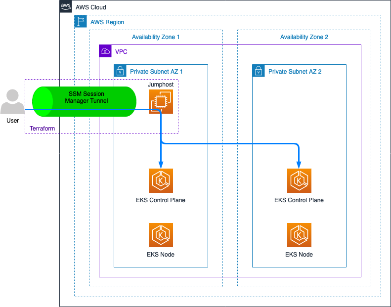

# EKS Jumphost

Terraform module to create an EC2 instance used as a jumphost to interact with a private EKS cluster.

## Architecture



## Usage

```terraform
module "eks_jumphost_instance" {
  source = "../.."

  https_egress_cidr_blocks      = var.https_egress_cidr_blocks
  https_egress_ipv6_cidr_blocks = var.https_egress_ipv6_cidr_blocks
  kms_key_id                    = var.kms_key_id
  monitoring                    = var.monitoring
  subnet_id                     = var.subnet_id
  tags                          = var.tags
  vpc_id                        = var.vpc_id
}


resource "null_resource" "deploy_eks_sample_app" {
  provisioner "local-exec" {
    command = file(module.eks_jumphost_instance.start_eks_jumphost_path)
    environment = {
      AWS_PAGER   = "",
      INSTANCE_ID = module.eks_jumphost_instance.instance_id,
      REGION      = var.region,
    }
  }
  provisioner "local-exec" {
    command = "aws eks update-kubeconfig --name $CLUSTER_ID --region $REGION"
    environment = {
      AWS_PAGER  = "",
      CLUSTER_ID = var.cluster_id,
      REGION     = var.region,
    }
  }
  provisioner "local-exec" {
    command = templatefile(module.eks_jumphost_instance.execute_script_jumphost_path, {
      script = <<-EOT
      HTTPS_PROXY=socks5://127.0.0.1:8443 kubectl apply -f app/manifests
      EOT
    })
    environment = {
      AWS_PAGER   = "",
      INSTANCE_ID = module.eks_jumphost_instance.instance_id,
      LOCAL_PORT  = 8443,
      NO_PROXY    = "",
      REGION      = var.region,
    }
  }
  provisioner "local-exec" {
    command = file(module.eks_jumphost_instance.stop_eks_jumphost_path)
    environment = {
      AWS_PAGER   = "",
      INSTANCE_ID = module.eks_jumphost_instance.instance_id,
      REGION      = var.region,
    }
  }
  triggers = {
    app = sha1(join("", [for file in fileset(path.cwd, "app/**") : filesha1(file)])),
  }
}
```

## Considerations

This Terraform module creates an EC2 instance that can be used as a jumphost to interact with a private EKS cluster.

Its usage is meant for development environments, not production: in the latter case provisioning should be done via a continuous integration and deployment platform.

The scripts provided as part of the module are compatible with UNIX-based workstations only.

Prerequisites to run the scripts are:

- [AWS CLI version 2](https://docs.aws.amazon.com/cli/latest/userguide/getting-started-install.html);
- [Session Manager plugin](https://docs.aws.amazon.com/systems-manager/latest/userguide/session-manager-working-with-install-plugin.html).

## Examples

- [Configure self managed group](./examples/configure_self_managed_group/): configures an [EKS self managed node group](https://docs.aws.amazon.com/eks/latest/userguide/worker.html);
- [deploy EKS sample app](./examples/deploy_eks_sample_app/): deploys an [EKS sample app](https://docs.aws.amazon.com/eks/latest/userguide/sample-deployment.html).

## Contributing

Follow the instructions in [prerequisites](#prerequisites) then refer to the [contributing guidelines](./CONTRIBUTING.md).

### Prerequisites

Install on your workstation the following tools:

- [AWS CLI version 2](https://docs.aws.amazon.com/cli/latest/userguide/getting-started-install.html);
- [Terraform](https://learn.hashicorp.com/tutorials/terraform/install-cli) (>= 1.1.0);
- [pre-commit](https://pre-commit.com/);
- [checkov](https://www.checkov.io/);
- [TFLint](https://github.com/terraform-linters/tflint);
- [tfsec](https://github.com/aquasecurity/tfsec).

Then initialize `pre-commit` by running:

```bash
pre-commit install
```

## License

See [LICENSE](./LICENSE).
